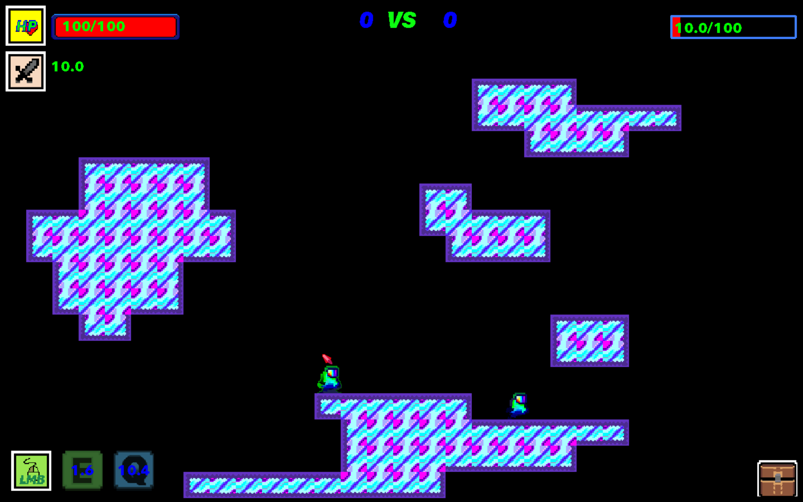

# Техническое задание проекта

### Структура игры:

###### - Меню
###### - Карта подготовки
###### - Основная карта

## 1. Запуск

  #### При запуске появляется меню - окно с выбором героя (всего 3 персонажа), с выбором размера окна, с регулировкой громкости музыки и спецэффектов, с кнопкой для начала игры
  
  ##### Во весь экран
  
  ##### 1024х640
  

  #### Нажатие на start game открывает окно с ожиданием второго игрока
  #### Второй игрок должен быть в пределах одной сети с первым игроком, чтобы играть на одном сервере
  
  

  ##### Как только второй игрок подкючится запускается карта подготовки

## 2. Карта подготовки

#### В течение некоторого времени (180-720 секунд) на карте подготовке игроку предстоит собрать ресурсы и улучшить навыки своего персонажа

#### На полученные ресурсы и валюту игрок может улучшить свои навыки у библиотекаря (неигровой персонаж) или купить новое снаряжение у кузнеца (неигровой персонаж)
  
  

## 2.1 Карта паркура

#### Попасть на эту карту можно из карты подготовки (через дверь)

  ###### Сбор алмазов (игровая валюта)
  
  
  
  

## 3. Основная игра

  #### После окончания времени на карте подготовки, игроков перекидывает на основную карту, на которой они могут сразиться друг с другом в реальном времени. Побеждает игрок, первым выигравший 3 раунда.
  
  #### В основной игре предусмотрено 5 карт для каждого из раундов
   
   
